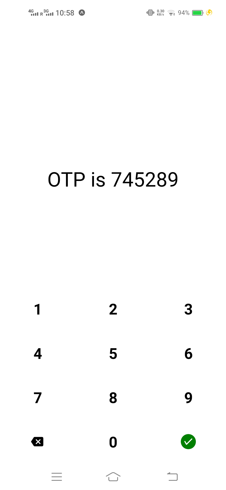
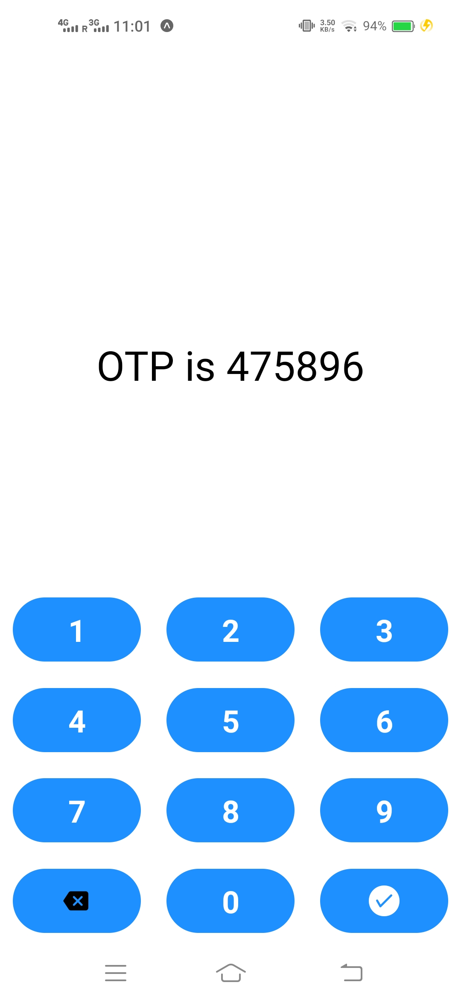
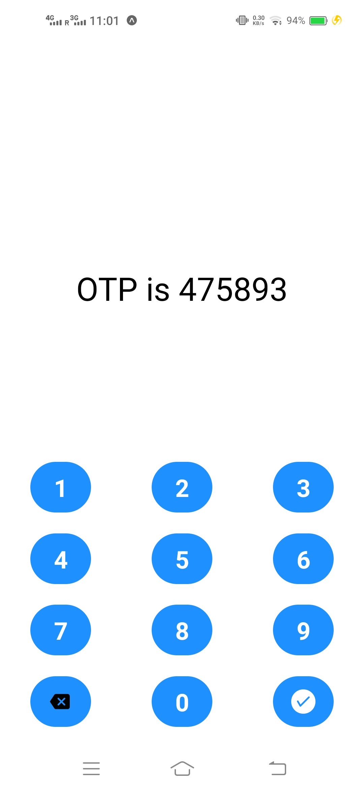
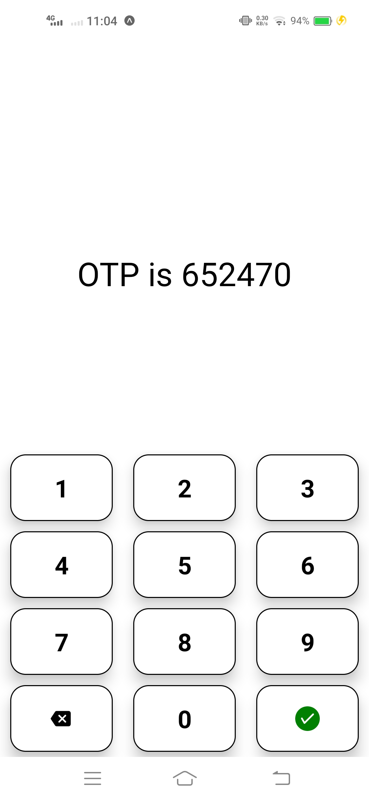
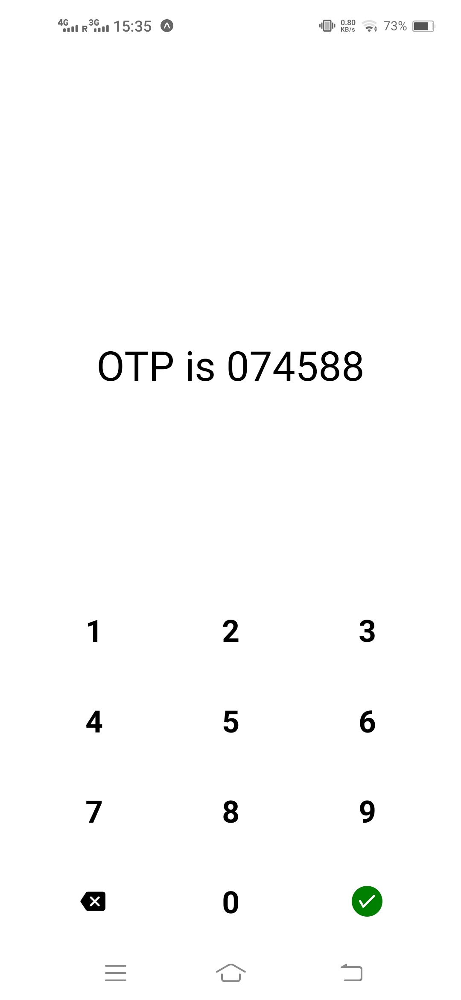

# react-native-otp-keyboard

A package for Custom OTP keyboard. This can be customized according to needs.

Compatible with both React Native CLI and Expo Managed apps.

- [Installation](https://github.com/kartikeyvaish/react-native-otp-keyboard#installation)
- [Usage](https://github.com/kartikeyvaish/react-native-otp-keyboard#usage)
- [Docs](https://github.com/kartikeyvaish/react-native-otp-keyboard#parameters)

## Installation

```javascript
npm i react-native-otp-keyboard
```

## Usage

Below are some examples to use this package

### Basic Usage

```javascript
import OTPInput from "react-native-otp-keyboard";

const [OTP, SetOTP] = useState("");
// Maintain a state variable

// Use it like this
<OTPKeyboard
  onSubmitPress={(text: string) => console.log(text)}
  onPress={SetOTP}
/>;
```



---

### Some Examples






---

## Parameters

| Parameter               | required | Default                | Description                                                             |
| ----------------------- | -------- | ---------------------- | ----------------------------------------------------------------------- |
| keys                    | NO       | `See Docs`             | Keys array to display, you can manipulate it. Take a look at the Props. |
| backspaceComponent      | NO       | null                   | component to render in place of backspace key                           |
| submitComponent         | NO       | null                   | component to render in place of submit key                              |
| keyboardStyle           | NO       |                        | styling for keyboard container                                          |
| digitBoxStyle           | NO       |                        | styling for each digit box                                              |
| keyboardBackgroundColor | NO       | `white`                | background color for keyboard container                                 |
| digitBoxBackgroundColor | NO       |                        | background color for digit box container                                |
| digitColor              | NO       | 60                     | Each digit text color                                                   |
| width                   | NO       | `Screen Width`         | width of the keyboard container                                         |
| height                  | NO       | `40% of Screen Height` | height of the keyboard container                                        |
| onPress                 | NO       |                        | callback to execute when user presses the key                           |
| onSubmitPress           | NO       |                        | callback to execute when user presses the submit key                    |
| maxLength               | NO       |                        | maxLength of keyboard input                                             |
